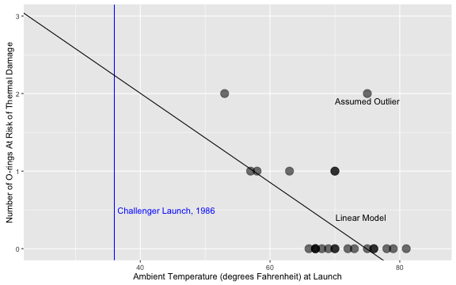

## Decision: Should The Space Shuttle Launch?

* In 1986, the Space Shuttle Challenger exploded on launch, killing the crew
* Subsequent investigation showed that an o-ring seal on one of the solid rocket boosters failed
  - Low amient temperatures during launch resulted in a lack of o-ring resilience, allowing hot combustion gases to "blow-by"
* Data on 23 previous launches suggested o-rings were at risk of thermal degradation at cooler ambient temperatures
  - Data were not available for temperatures below 53 degrees Fahrenheit
  - Ambient temperature on the morning of Challenger launch was 36 degrees Fahrenheit

---

## Existing Data

* "orings" - total number of o-rings, 
* "at-risk" - number of o-rings at risk of thermal damage or blow-by
* "temp" - ambient temperature (degrees Fahrenheit)
* "leak_test_P" - pressure (pounds per square inch, or psi)
* "test_no" - test (launch) number


```
##   orings at_risk temp leak_test_P test_no
## 1      6       0   66          50       1
## 2      6       1   70          50       2
## 3      6       0   69          50       3
## 4      6       0   68          50       4
## 5      6       0   67          50       5
```


---

## Linear Model

```r
training <- subset(data, !(temp > 70 & at_risk > 1)) # Remove clear outlier
model <- lm(at_risk ~ temp, data=training)
```




---

## Application

* User selects an expected ambient temperature for space shuttle launch
* Linear regression model predicts number of o-rings at risk for thermal degradation
  - Data are an integer count of number of o-rings at risk
  - Model predicts fractional number of o-rings at risk
* Prediction used as proxy to determine whether to launch
  - If < 1, launch is safe
  - If >= 1, launch is not safe
  
### Reference
University of California - Irvine, Machine Learning Repository
[Space Shuttle O-Ring Data Set](https://archive.ics.uci.edu/ml/datasets/Challenger+USA+Space+Shuttle+O-Ring)


